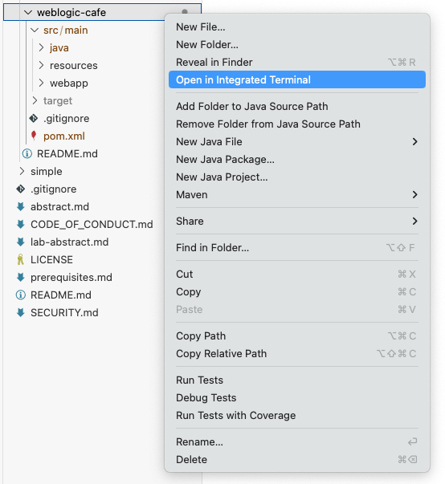
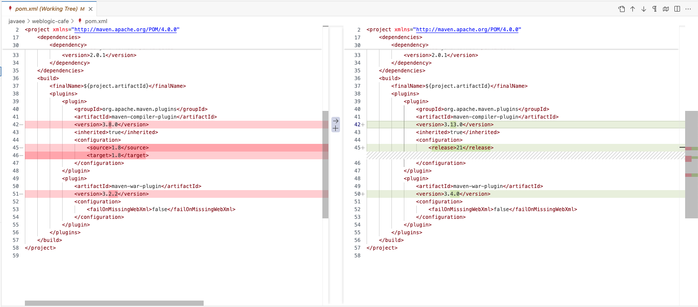
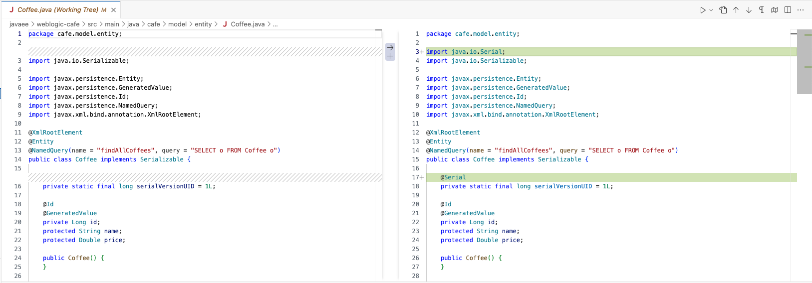

# Examples for Rewrite-WebLogic

Starting with Oracle WebLogic Server 14.1.2, Oracle provides OpenRewrite recipes to help you upgrade your applications to new WebLogic and Java versions. The example on this page is intended to demonstrate how to use the recipes to upgrade a sample application.

## WebLogic Cafe Example

Let’s walk through an example. We will use the WebLogic Cafe example that is available on GitHub: https://github.com/microsoft/weblogic-on-azure. This is a simplified Java EE application that is used in many demos. We will run the rewrite-weblogic recipes locally, so we will need to get a copy of the code locally, too.

### Step 1: Start by making sure that you have the pre-requisites:
1.	Make sure that you have Java 8 or later installed.
1.	Make sure that you have Maven 3.x installed.
1.	Clone the weblogic-on-azure repo:

```shell
git clone https://github.com/microsoft/weblogic-on-azure.git
```

### Step 2: Sync Maven dependencies
For OpenRewrite to run, Maven dependencies need to be resolved. If needed, run `mvn clean install` for missing dependencies, such as:

```shell
mvn clean install
```
Other commands can be used, as well, such as `mvn dependency:resolve`.

### Step 3: Execute the Maven command to run OpenRewrite
For this example, we will upgrade the weblogic-cafe application to run on WebLogic Server 14.1.2 with JDK 21. Alternatively, you can upgrade the application to run on JDK 17, also with WebLogic Server 14.1.2.

1.	Open a terminal at the weblogic-cafe folder

    You must open to the folder where the pom file is located:
    ``` weblogic-on-azure/javaee/weblogic-cafe ```

    Preferably, you should open a terminal within your IDE. 

    

1.	Execute the following command to run OpenRewrite:

```shell
mvn -U org.openrewrite.maven:rewrite-maven-plugin:run \
  -Drewrite.recipeArtifactCoordinates=com.oracle.weblogic.rewrite:rewrite-weblogic:0.3.0 \
  -Drewrite.activeRecipes=com.oracle.weblogic.rewrite.UpgradeTo1412,org.openrewrite.java.migrate.UpgradeToJava21
```

The command applies the following recipes:
- com.oracle.weblogic.rewrite.UpgradeTo1412
- com.oracle.weblogic.rewrite.UpgradeWeblogicMavenPropertyVersion
- org.openrewrite.java.migrate.UpgradeToJava21

OpenRewrite updates the weblogic-cafe code in the following ways:
- Pom.xml – updates versions and namespaces
- Source files –
  - Updates Java dependencies and related statements 
  - Updates WebLogic API dependencies and related statements
  - For removed APIs with no replacement, OpenRewrite inserts a comment in the code stating that the API usage needs to be resolved or removed.

### Step 3: Review the results

The easiest way to see the results of the upgrade is to compare the updated files to the previous version in GitHub or in your IDE.

For example, the following image shows file changes for the ```pom.xml``` file in VS Code:



The following image shows a source file with code changes applied:


### Step 4: Deploy the application

Optionally, if you have a WebLogic 14.1.2 domain available, you can deploy the weblogic-cafe application using your standard deployment tools.
